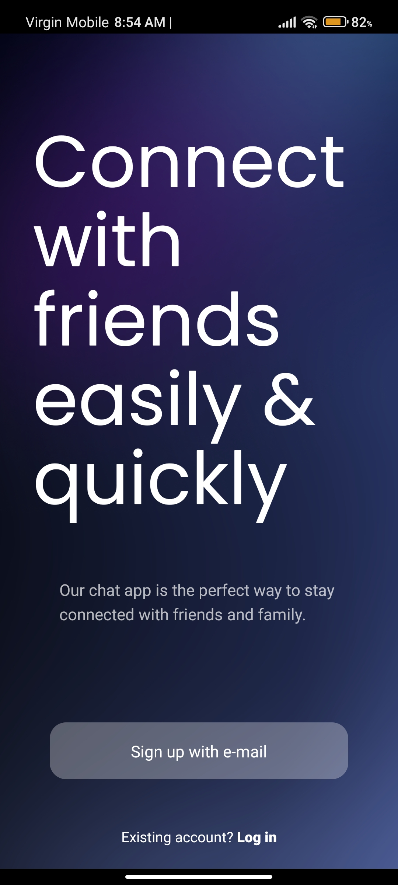
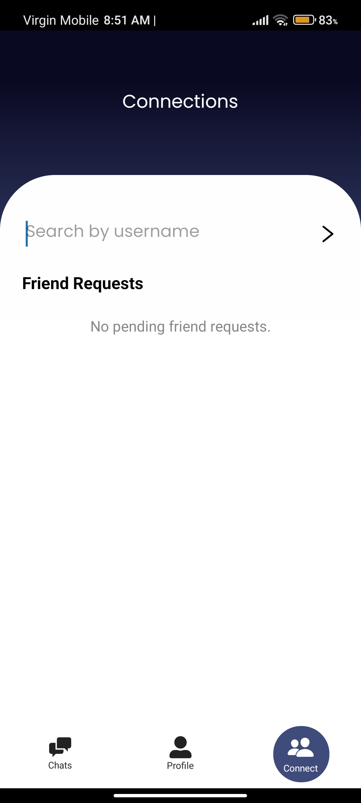
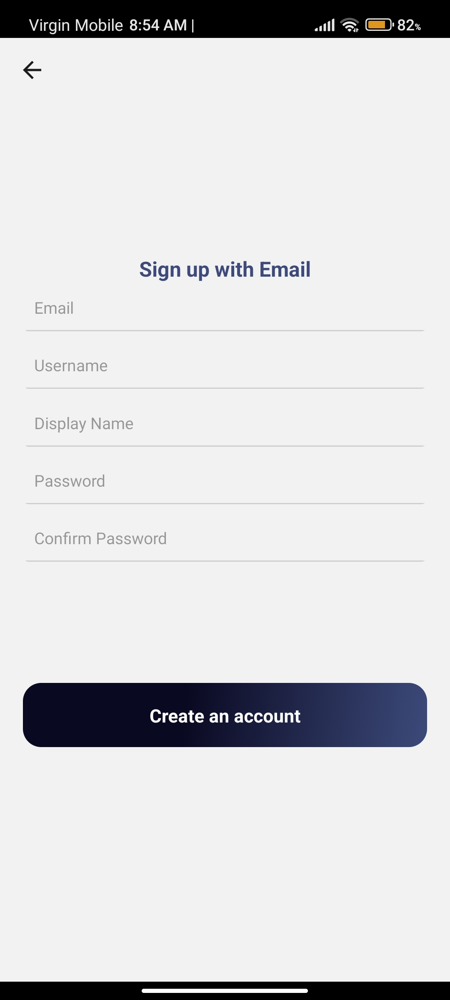
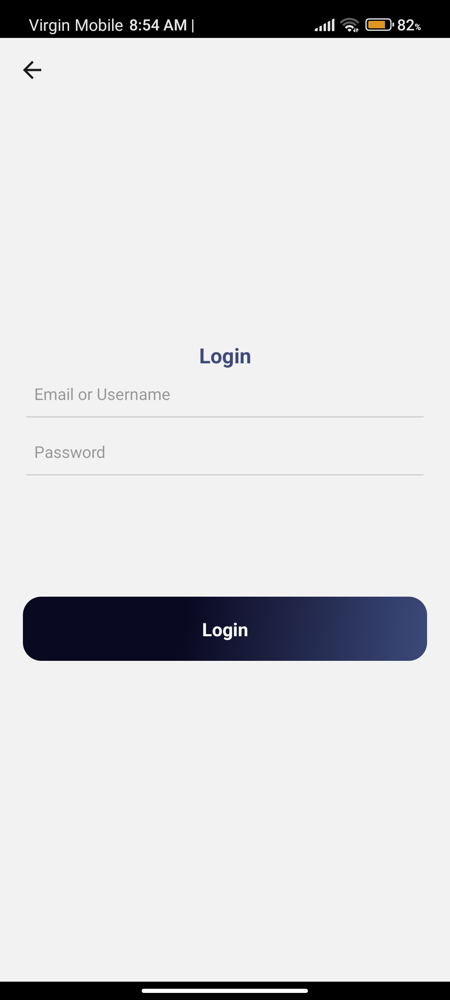
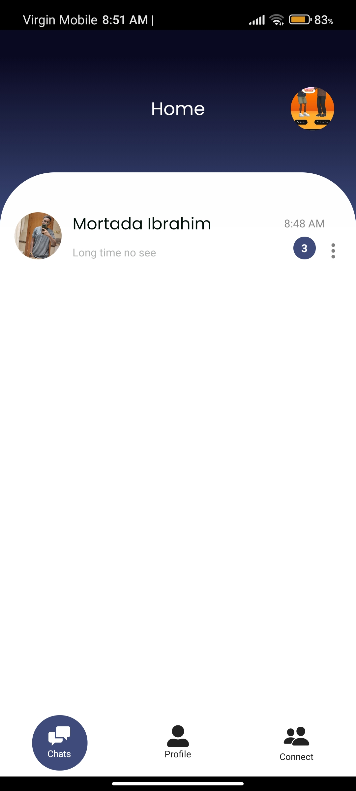
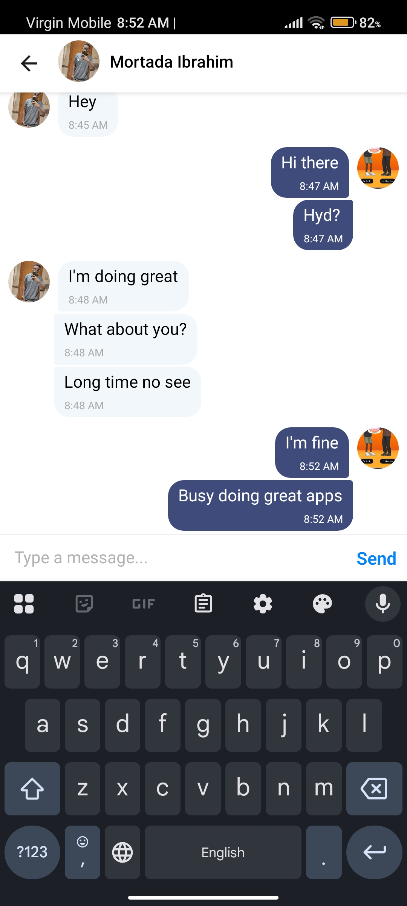
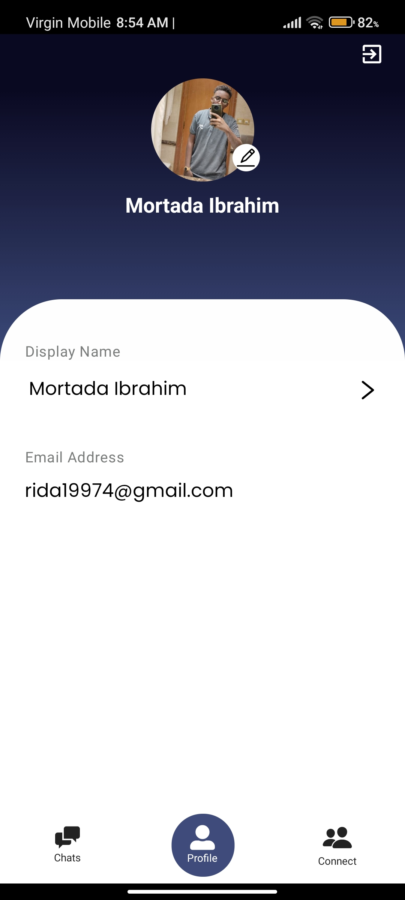
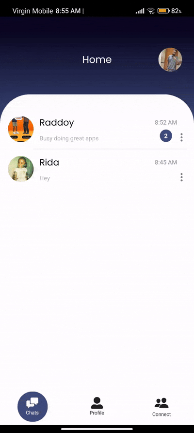

# React Native Messaging App

A sleek and modern chat app built with **React Native**, **Expo Router**, and **Firebase**. This app allows users to search for friends, send and accept friend requests, and chat with their friends securely and in real time.

## ✨ Features

### 🔐 Authentication
- Firebase Authentication for user sign-in and sign-up
- Persistent login state
- Supports Google Auth (optional)

### 👤 User Profiles
- Set a unique `username` (used for searching)
- Display name and profile photo support
- Profile picture upload using Firebase Storage

### 🧭 Navigation
- Tab-based navigation using **Expo Router**
- Stack navigation for chat detail screens with custom headers

### 🕵️‍♂️ Search & Add Friends
- Search users by username
- Send friend requests directly from the search results
- Clear search results automatically when the input is cleared

### 📥 Friend Requests
- View incoming friend requests in a dedicated tab
- Accept or reject requests
- Automatically start a new chat after accepting a request

### 💬 Chat System
- Real-time messaging (Firebase Firestore-based)
- Unique chat ID per pair of friends
- Custom header in chat screen with user info and quick actions

### 📦 Tech Stack
- React Native with Expo
- TypeScript
- Firebase (Auth, Firestore, Storage)
- NativeWind for styling
- Expo Router for navigation

## Screenshots

## Demo

